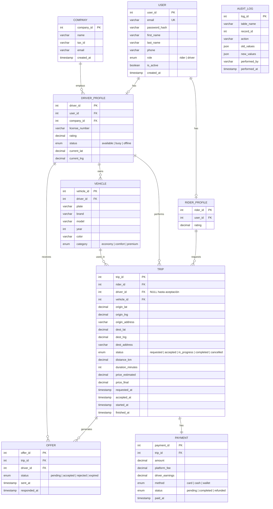

```mermaid
erDiagram
    USER {
        int user_id PK
        varchar email UK
        varchar password_hash
        varchar first_name
        varchar last_name
        varchar phone
        enum role "rider | driver"
        boolean is_active
        timestamp created_at
    }

    RIDER_PROFILE {
        int rider_id PK
        int user_id FK
        decimal rating
    }

    DRIVER_PROFILE {
        int driver_id PK
        int user_id FK
        int company_id FK
        varchar license_number
        decimal rating
        enum status "available | busy | offline"
        decimal current_lat
        decimal current_lng
    }

    COMPANY {
        int company_id PK
        varchar name
        varchar tax_id
        varchar email
        timestamp created_at
    }

    VEHICLE {
        int vehicle_id PK
        int driver_id FK
        varchar plate
        varchar brand
        varchar model
        int year
        varchar color
        enum category "economy | comfort | premium"
    }

    TRIP {
        int trip_id PK
        int rider_id FK
        int driver_id FK "NULL hasta aceptación"
        int vehicle_id FK
        decimal origin_lat
        decimal origin_lng
        varchar origin_address
        decimal dest_lat
        decimal dest_lng
        varchar dest_address
        enum status "requested | accepted | in_progress | completed | cancelled"
        decimal distance_km
        int duration_minutes
        decimal price_estimated
        decimal price_final
        timestamp requested_at
        timestamp accepted_at
        timestamp started_at
        timestamp finished_at
    }

    OFFER {
        int offer_id PK
        int trip_id FK
        int driver_id FK
        enum status "pending | accepted | rejected | expired"
        timestamp sent_at
        timestamp responded_at
    }

    PAYMENT {
        int payment_id PK
        int trip_id FK
        decimal amount
        decimal platform_fee
        decimal driver_earnings
        enum method "card | cash | wallet"
        enum status "pending | completed | refunded"
        timestamp paid_at
    }

    AUDIT_LOG {
        int log_id PK
        varchar table_name
        int record_id
        varchar action
        json old_values
        json new_values
        varchar performed_by
        timestamp performed_at
    }

    %% RELACIONES

    USER ||--o| RIDER_PROFILE : has
    USER ||--o| DRIVER_PROFILE : has

    COMPANY ||--o{ DRIVER_PROFILE : employs

    DRIVER_PROFILE ||--o{ VEHICLE : owns

    RIDER_PROFILE ||--o{ TRIP : requests

    DRIVER_PROFILE ||--o{ TRIP : performs

    VEHICLE ||--o{ TRIP : used_in

    TRIP ||--o{ OFFER : generates
    DRIVER_PROFILE ||--o{ OFFER : receives

    TRIP ||--|| PAYMENT : has
```