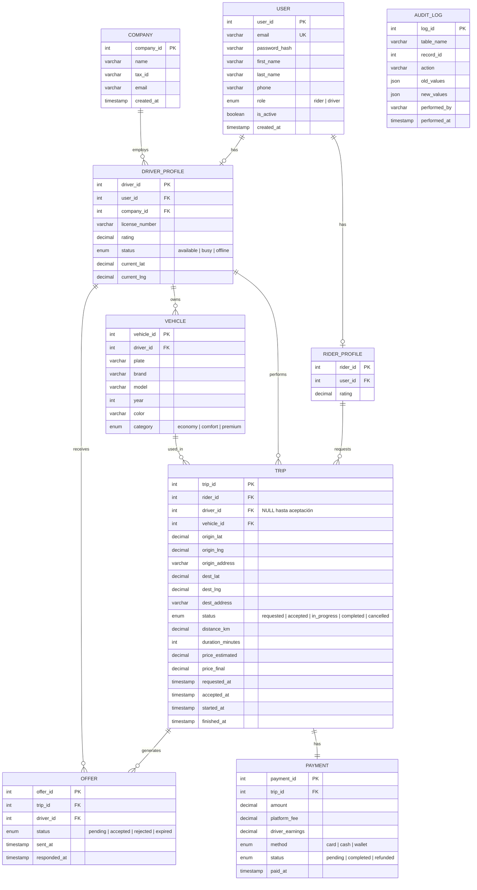

# 📐 Diseño Arquitectónico de la Base de Datos

En este documento detallamos la arquitectura del modelo de datos de nuestra plataforma de Ride-Hailing, justificando las decisiones técnicas aplicadas para garantizar la escalabilidad, el rendimiento y la integridad transaccional del sistema.

## 1. Modelo Entidad-Relación (MER)

A continuación se muestra el diagrama estructural de las entidades y sus relaciones (representado mediante Mermaid):

---

## 2. Decisiones de Diseño y Normalización

El esquema ha sido diseñado siguiendo los principios de la **Tercera Forma Normal (3FN)** para evitar redundancias y anomalías de actualización. A continuación, se explican las decisiones de modelado más críticas:

### A. Especialización de Usuarios (Herencia)
En lugar de tener una única tabla masiva de `USERS` con decenas de campos nulos dependiendo de si el usuario es un pasajero o un conductor (Ej: un pasajero no tiene `license_number` ni `company_id`), hemos implementado una **relación de especialización (1:1)**. 
- La tabla `USER` contiene los datos comunes y credenciales.
- Las tablas `RIDER_PROFILE` y `DRIVER_PROFILE` extienden a `USER` añadiendo exclusivamente la información pertinente a cada rol. Esto reduce el espacio de almacenamiento y garantiza la integridad de los datos.

### B. Desnormalización Estratégica: Geolocalización en TRIP
Aunque la teoría relacional estricta podría sugerir crear una tabla externa `LOCATION` (almacenando latitudes y longitudes globales) y vincularla a los viajes, esto supondría un impacto masivo en el rendimiento. En un sistema de Ride-Hailing, se ejecutan miles de consultas por segundo buscando viajes en ciertas áreas. Por ello, hemos optado por incrustar de forma directa las coordenadas (`origin_lat`, `origin_lng`, `dest_lat`, `dest_lng`) dentro de la tabla `TRIP`. Esto evita operaciones `JOIN` altamente costosas y acelera el acceso a disco.

### C. Sistema de Ofertas de Alta Concurrencia
Para cumplir con el requisito de que "la solicitud genera una oferta a múltiples conductores, y el primero se la queda", hemos extraído la lógica de adjudicación a la tabla `OFFER`. Múltiples registros `OFFER` se generan para un mismo `TRIP`. El modelo está preparado para soportar **bloqueos de fila pesimistas (`FOR UPDATE`)** en la tabla `OFFER`, garantizando a nivel de motor (InnoDB) que es matemáticamente imposible que dos conductores acepten el mismo viaje.

---

## 3. Estrategia de Índices (Optimización)

Para asegurar que los paneles de análisis en Grafana y la operativa móvil del conductor fluyan en tiempo real, hemos desarrollado índices de tipo `B-Tree` sobre las columnas más estresadas en las cláusulas `WHERE`:

1. **`idx_trip_status` en `TRIP(status)`:** Vital para el Dashboard de negocio. Permite calcular ingresos, viajes cancelados y carga de la plataforma de forma casi instantánea sin recorrer toda la tabla (Full Table Scan).
2. **`idx_driver_status` en `DRIVER_PROFILE(status)`:** Utilizado masivamente por el sistema para encontrar rápidamente a todos los conductores cuyo estado sea `available` y enviarles ofertas.
3. **`idx_user_email` en `USER(email)`:** Minimiza el tiempo de acceso en la validación de credenciales (Logins) del backend de la app.
4. **`idx_user_role` en `USER(role)`:** Permite realizar barridos rápidos en auditorías para segregar perfiles dentro de la tabla genérica.

Además de estos índices manuales, MariaDB crea automáticamente índices en todas las **Claves Foráneas (FKs)**, lo cual resulta crítico para la rápida ejecución de operaciones `JOIN` al calcular métricas de ingresos (`PAYMENT` -> `TRIP` -> `COMPANY`).