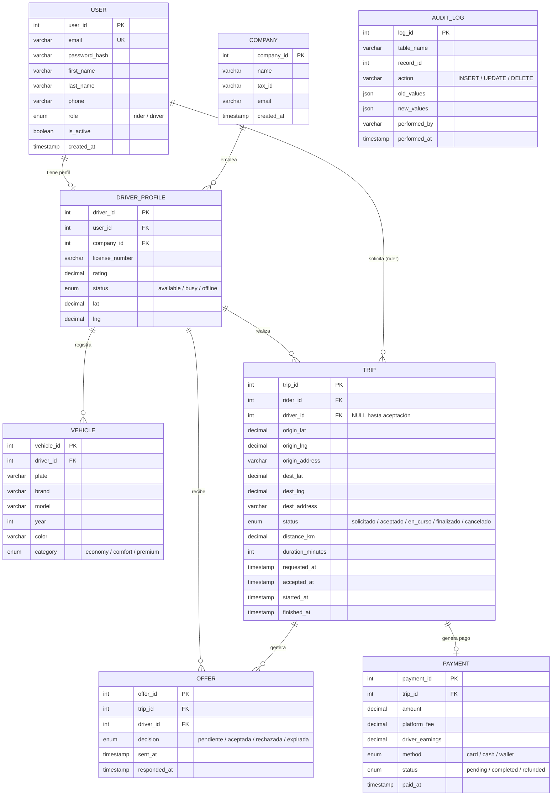
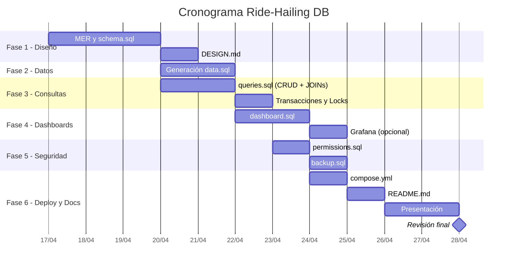

# 🚗 Plan de Desarrollo — Base de Datos Ride-Hailing

## Resumen del Proyecto

Diseñar e implementar una **base de datos relacional** para una plataforma de ride-hailing (tipo Uber/Bolt/Lyft), con despliegue en Docker, dashboards de monitorización y defensa oral con presentación.

> [!IMPORTANT]
> **Equipo**: 4 personas · **Entregables**: 10 archivos · **Defensa**: Presentación oral + calificación grupal e individual

---

## 1. Análisis de Requisitos

### 1.1 Caso de Uso Principal

```
Rider solicita viaje (A → B con geolocalizaciones)
    → Se genera una OFERTA
    → Se envía a MÚLTIPLES conductores
    → El PRIMER conductor que acepta se queda el viaje y el pago
    → Cada conductor pertenece a una COMPANY
```

### 1.2 Entidades Identificadas

| Entidad | Descripción | Notas clave |
|---------|-------------|-------------|
| **User** | Usuarios de la plataforma | Dos roles: `rider` y `driver` |
| **Driver Profile** | Perfil extendido del conductor | Licencia, rating, estado activo |
| **Company** | Empresa a la que pertenece el conductor | Relación 1:N con drivers |
| **Vehicle** | Vehículos registrados | Asociados a un conductor |
| **Trip** | Viaje solicitado | Estados: `solicitado`, `aceptado`, `en curso`, `finalizado`, `cancelado` |
| **Offer** | Oferta enviada a un conductor | Decisión: `pendiente`, `aceptada`, `rechazada`, `expirada` |
| **Payment** | Registro de pago del viaje | Vinculado al viaje aceptado |
| **Audit Log** | Historial de operaciones | Auditoría básica de cambios |

### 1.3 Requisitos Operativos (Métricas)

| Métrica | Tipo | Detalle |
|---------|------|---------|
| Tasa de aceptación | Negocio | Por conductor y por company |
| Tiempo medio de viaje | Negocio | Duración media en minutos |
| Kilometraje medio | Negocio | Distancia media por viaje |
| Ingresos por conductor | Negocio | Total, €/km, €/min |
| Ingresos por company | Negocio | Total, €/km, €/min |
| Viajes por hora | Dashboard | Monitorización en tiempo real |
| Ofertas aceptadas/rechazadas | Dashboard | Ratio de conversión |
| Métricas de BD | Dashboard DB | Conexiones, queries lentas, tamaños |

---

## 2. Modelo Entidad-Relación (MER) Propuesto



---

## 3. Fases de Desarrollo

### Fase 1 — Diseño y Esquema (`schema.sql` + `DESIGN.md`)
> **Prioridad**: 🔴 Crítica · **Estimación**: 2-3 días

| Tarea | Detalle |
|-------|---------|
| Diseñar el MER definitivo | Validar entidades, relaciones y cardinalidades |
| Crear `schema.sql` | DDL: CREATE DATABASE, CREATE TABLE, constraints (PK, FK, UNIQUE, CHECK) |
| Definir tipos de datos | Especial atención a geolocalizaciones (DECIMAL), enums, timestamps |
| Crear índices | Índices para búsquedas frecuentes (ver sección 4) |
| Documentar en `DESIGN.md` | Diagrama Mermaid, justificación de decisiones, normalización |

> [!TIP]
> **Decisión de diseño**: Usar una tabla `USER` unificada con campo `role` (rider/driver) en lugar de dos tablas separadas. Los conductores tienen una tabla extendida `DRIVER_PROFILE` para datos específicos.

---

### Fase 2 — Datos de Prueba (`data.sql`)
> **Prioridad**: 🟡 Alta · **Estimación**: 1-2 días

| Tarea | Detalle |
|-------|---------|
| Generar datos realistas | Nombres, emails, coordenadas de ciudades reales |
| Carga masiva | INSERTs para users (~100), vehicles (~50), trips (~500), offers (~1500) |
| Coherencia de datos | Estados consistentes (si trip=finalizado → debe haber payment) |
| Script reproducible | Que se pueda ejecutar de cero tras `schema.sql` |

> [!NOTE]
> Se puede usar un script Python/Faker para generar los datos masivos automáticamente y luego exportarlos a SQL.

---

### Fase 3 — Consultas y Operativa (`queries.sql`)
> **Prioridad**: 🔴 Crítica · **Estimación**: 2-3 días

| Tipo | Consultas requeridas |
|------|---------------------|
| **CRUD básico** | Insertar rider, driver, vehículo, trip, oferta |
| **JOINs** | Trips con info de rider + driver + company + vehicle |
| **Transacciones** | Aceptar oferta → actualizar trip → rechazar otras ofertas → crear payment |
| **Locks (concurrencia)** | `SELECT ... FOR UPDATE` para evitar que 2 drivers acepten la misma oferta |
| **Subconsultas** | Top conductores por rating, trips por zona geográfica |
| **Aggregaciones** | Promedios, conteos, sumas agrupadas por conductor/company |

> [!WARNING]
> **Punto crítico de concurrencia**: La aceptación de oferta DEBE usar `SELECT ... FOR UPDATE` dentro de una transacción para garantizar que solo un conductor acepte cada viaje. Este es un requisito explícito del enunciado.

**Ejemplo conceptual de la transacción de aceptación:**
```sql
START TRANSACTION;

-- Lock la oferta para evitar race conditions
SELECT * FROM offer WHERE offer_id = ? AND decision = 'pendiente'
FOR UPDATE;

-- Aceptar esta oferta
UPDATE offer SET decision = 'aceptada', responded_at = NOW()
WHERE offer_id = ? AND decision = 'pendiente';

-- Rechazar todas las demás ofertas del mismo viaje
UPDATE offer SET decision = 'rechazada', responded_at = NOW()
WHERE trip_id = ? AND offer_id != ? AND decision = 'pendiente';

-- Actualizar el viaje
UPDATE trip SET driver_id = ?, status = 'aceptado', accepted_at = NOW()
WHERE trip_id = ?;

COMMIT;
```

---

### Fase 4 — Dashboards (`dashboard.sql`)
> **Prioridad**: 🟡 Alta · **Estimación**: 2 días

#### Dashboard de Negocio
```
┌─────────────────────────────────────────────────────────┐
│  📊 DASHBOARD DE NEGOCIO                                │
├──────────────────┬──────────────────┬───────────────────┤
│ Viajes/hora      │ Tasa aceptación  │ Ingresos totales  │
│ Km medio/viaje   │ Tiempo medio     │ €/km · €/min      │
│ Top conductores  │ Top companies    │ Ofertas pendientes │
└──────────────────┴──────────────────┴───────────────────┘
```

| Consulta | Descripción |
|----------|-------------|
| Tasa de aceptación por conductor | `COUNT(aceptadas) / COUNT(total)` por driver |
| Tasa de aceptación por company | Agregación a nivel de company |
| Tiempo medio de viajes | `AVG(duration_minutes)` global y por company |
| Km medio de viajes | `AVG(distance_km)` global y por company |
| Ingresos por conductor | `SUM(driver_earnings)`, `SUM/SUM` para €/km y €/min |
| Ingresos por company | Agregación de ingresos de los conductores |
| Viajes por hora/día | `COUNT(*)` agrupado por `DATE_FORMAT` |

#### Dashboard de Base de Datos
| Consulta | Descripción |
|----------|-------------|
| Conexiones activas | `SHOW PROCESSLIST` o `information_schema` |
| Tamaño de tablas | `information_schema.TABLES` |
| Queries lentas | `slow_query_log` |
| Estado del servidor | `SHOW GLOBAL STATUS` |

> [!TIP]
> Para visualizar los dashboards se puede integrar **Grafana** con el `compose.yml`. Grafana se conecta directamente a MySQL/MariaDB y permite crear paneles visuales.

---

### Fase 5 — Seguridad y Backup (`permissions.sql` + `backup.sql`)
> **Prioridad**: 🟠 Media-Alta · **Estimación**: 1-2 días

#### Usuarios de BD propuestos

| Usuario | Permisos | Justificación |
|---------|----------|---------------|
| `admin_ridehailing` | ALL PRIVILEGES | Administración total (solo DBA) |
| `app_backend` | SELECT, INSERT, UPDATE en tablas operativas | Conexión de la aplicación |
| `dashboard_reader` | SELECT en vistas de dashboard | Solo lectura para dashboards |
| `auditor` | SELECT en `audit_log` + vistas | Auditoría sin modificar datos |
| `backup_user` | SELECT, LOCK TABLES, RELOAD | Para ejecutar `mysqldump` |

#### Plan de Backup

| Tipo | Frecuencia | Herramienta | Retención |
|------|------------|-------------|-----------|
| Full dump | Diario (3:00 AM) | `mysqldump --single-transaction` | 30 días |
| Binlog incremental | Continuo | `mysqlbinlog` | 7 días |
| Exportación CSV | Semanal | `SELECT INTO OUTFILE` | 90 días |

---

### Fase 6 — Despliegue y Documentación (`compose.yml` + `README.md` + `presentacion.pdf`)
> **Prioridad**: 🟡 Alta · **Estimación**: 2 días

#### Docker Compose (servicios)

```yaml
# Estructura propuesta del compose.yml
services:
  db:          # MySQL/MariaDB 8.x
  grafana:     # Dashboard visual (opcional pero muy recomendable)
  adminer:     # Interfaz web para gestión de BD (opcional)
```

#### README.md debe incluir:
- Requisitos previos (Docker, Docker Compose)
- Instrucciones de arranque (`docker compose up -d`)
- Cómo cargar el esquema y datos (`docker exec ... mysql < schema.sql`)
- Cómo acceder al dashboard
- Estructura de archivos del proyecto

---

## 4. Estrategia de Índices

| Índice | Tabla | Columnas | Justificación |
|--------|-------|----------|---------------|
| `idx_user_email` | user | email | Login y búsqueda de usuarios |
| `idx_user_role` | user | role | Filtrar riders vs drivers |
| `idx_driver_company` | driver_profile | company_id | JOINs con company |
| `idx_driver_status` | driver_profile | status | Buscar conductores disponibles |
| `idx_driver_location` | driver_profile | lat, lng | Búsqueda geográfica |
| `idx_trip_status` | trip | status | Filtrar viajes activos |
| `idx_trip_rider` | trip | rider_id | Historial del rider |
| `idx_trip_driver` | trip | driver_id | Historial del conductor |
| `idx_trip_requested` | trip | requested_at | Ordenar por fecha |
| `idx_offer_trip` | offer | trip_id | JOINs trip ↔ offer |
| `idx_offer_driver` | offer | driver_id | Ofertas por conductor |
| `idx_offer_decision` | offer | decision | Filtrar pendientes |
| `idx_payment_trip` | payment | trip_id | Buscar pago de un viaje |
| `idx_audit_table` | audit_log | table_name, record_id | Buscar cambios por entidad |

---

## 5. Distribución de Trabajo Sugerida (4 personas)

| Persona | Responsabilidad Principal | Entregables |
|---------|--------------------------|-------------|
| **P1 — Arquitecto/DBA** | Diseño del esquema, índices, normalización | `schema.sql`, `DESIGN.md` |
| **P2 — Datos y Operativa** | Datos de prueba, consultas CRUD, transacciones | `data.sql`, `queries.sql` |
| **P3 — Dashboards y Métricas** | Vistas, consultas analíticas, Grafana | `dashboard.sql`, `compose.yml` |
| **P4 — Seguridad y Documentación** | Permisos, backup, README, presentación | `permissions.sql`, `backup.sql`, `README.md`, `presentacion.pdf` |

> [!NOTE]
> Todos participan en la **revisión cruzada** y en la **defensa oral**. Cada persona debe entender TODO el proyecto, no solo su parte.

---

## 6. Cronograma Estimado



---

## 7. Checklist de Entregables

| # | Archivo | Contenido | Estado |
|---|---------|-----------|--------|
| 1 | `schema.sql` | CREATE DATABASE + TABLES + INDEXES | ✅ |
| 2 | `data.sql` | INSERTs masivos de datos de prueba | ✅ |
| 3 | `queries.sql` | CRUD + JOINs + Transacciones + Locks | ✅ |
| 4 | `dashboard.sql` | Consultas de dashboards (negocio + BD) | ✅ |
| 5 | `backup.sql` (`.sh`) | Plan de backup documentado + scripts | ✅ |
| 6 | `permissions.sql` | Usuarios de BD + GRANTs justificados | ✅ |
| 7 | `compose.yml` | Docker Compose (BD + dashboard) | ✅ |
| 8 | `README.md` | Instrucciones completas de arranque | ✅ |
| 9 | `DESIGN.md` | Documentación de diseño + MER Mermaid | ✅ |
| 10 | `presentacion.pdf` | Presentación para la defensa | ⬜ |

---

## 8. Aspectos Clave para la Defensa

> [!CAUTION]
> Estos son los puntos que probablemente evaluarán con más detalle:

1. **Concurrencia**: Explicar cómo se evita que dos conductores acepten la misma oferta (locks + transacciones)
2. **Normalización**: Justificar el nivel de normalización elegido (3FN mínimo)
3. **Índices**: Saber explicar POR QUÉ cada índice existe y cómo mejora el rendimiento
4. **Seguridad**: Principio de mínimo privilegio en los usuarios de BD
5. **Backup**: Justificar la estrategia (RPO y RTO)
6. **Escalabilidad**: Qué pasaría con millones de viajes (particionamiento, archivado)
